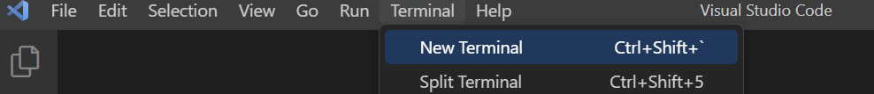
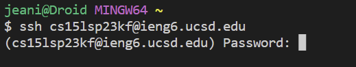

# **Lab 1**
Tutorial on loggining into ieng6

## **Step 1:** Hop into VS Code.

If you do not have VS Code already on your computer, install the latest version (here is the link: https://code.visualstudio.com/).
There are different versions for different OS (ex macOS, Linux, or Windows)

You should see something like this:

---

## **Step 2:** Remotely Connecting

(IF you have windows, make sure to install this GIT first (Here is the link: https://gitforwindows.org/))

First install this GIT https://git-scm.com/download/win

We need to set the terminal to git bash (it's what we just installed!)

Go to the terminal tab above and select "*New Terminal*"

Then use `Ctrl` + `Shift` + `p` to open the command palette

After, type "*Select Default Profile*"

From the options, select "*Git Bash*"

Lastly, click the + sign in the terminal window

Now you can select between different terminals

NOW, in the terminal, type 

`$ ssh cs15lsp23__@ieng6.ucsd.edu`

(replace the __ with your specific letters found in your account)

If this is your first time connecting, a message will pop up asking if you want to continue connecting. Type in "*yes*".

Then type in your password that you put in for your account.

You will then see this pop up in the terminal

You have now remotely connected!

---

## **Step 3:** Trying some commands

First we need to "*ssh*" (type ssh into the terminal)

Now we can try out different commands

For example, let's try . . .

`ls -lat`

You should see something like:

`ls -a`

You should see something like:

try these too! : 

* `cd`
   - this means to change directories, which moves the command prompt to a different folder
* `ls`
   - this list files in the current directory 
* `ls <directory> where <directory> is /home/linux/ieng6/cs15lsp23/cs15lsp23abc, where the abc is one of the other group members’ username`
   - this lists the files in abc's directory
* `pwd`
   -this prints the working directory, which displays the current working directory
  
