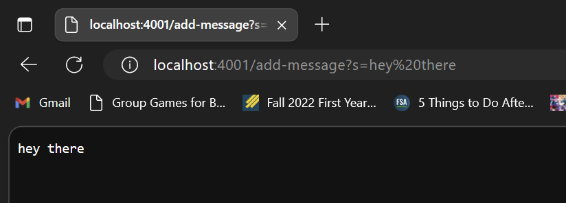
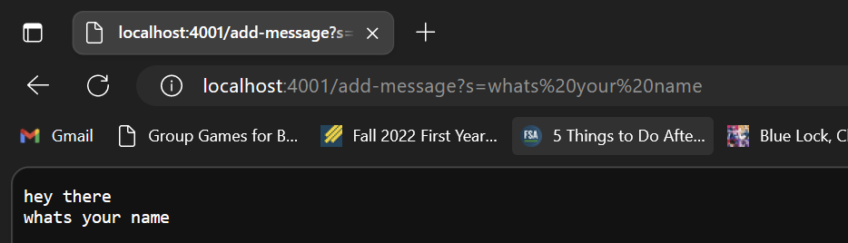
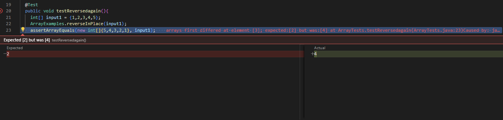
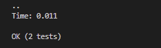
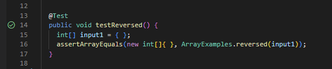

# **Lab Report 2**
Servers and Bugs

## **Part 1** Web Server

Code 
````
import java.io.IOException;
import java.net.URI;

class Handler implements URLHandler {
    String current = "";

    public String handleRequest(URI url) {
        if (url.getPath().equals("/")) {
            return String.format(current);
        }
        else {
            System.out.println("Path: " + url.getPath());
            if (url.getPath().contains("/add-message")) {
                String[] parameters = url.getQuery().split("=");
                    current += (parameters[1] + "\n");
                    return String.format(current);
                }
        }
        return "404 Not Found!";
    }
}
class StringServer {
    public static void main(String[] args) throws IOException {
        if(args.length == 0){
            System.out.println("Missing port number! Try any number between 1024 to 49151");
            return;
        }
        int port = Integer.parseInt(args[0]);
        Server.start(port, new Handler());
    }
}
````
 

In this first screenshot, within the `Handler` class, the `handleRequest` method is being called.  An aruguement, the url of type `URI`, is relevant to the method. There is a string varible called `current` which tracks the strings that are added by incoming request. From this specific request, by adding the url path of ````/add-message?s=hey%there````, the string variable current is updated to ````hey there```` + "\n".

 
 
In this second screenshot, within the Handler class, the `handleRequest` method is being called. An aruguement, the url of type `URI`, is relevant to the method. There is a string varible called `current` which tracks the strings that are added by incoming request. From this specific request, by adding the url path of ````/add-message?s=whats%your%name````, the string variable current is updated to ````hey there```` + "\n" + ````whats your name```` + "\n".

## **Part 2** Choosing one of the bugs from lab 3.

1. failure-inducing input for the buggy program

```
@Test
  public void testReversedagain(){
    int[] = input1 = {1,2,3,4,5};
    ArrayExamples.reverseInPlace(input1);
    assertArrayEquals(new int [] {5,4,3,2,1}, input1_;
  }
````
2. input that doesn't induce a failure
````
  @Test
  public void testReversed() {
    int[] input1 = { };
    assertArrayEquals(new int[]{ }, ArrayExamples.reversed(input1));
  }
````
3. symptoms of running the test
  a. running the failure-inducing input
  
  b. running the input that doesn't induce a failure
  
    
    
4. Before and After Code Change
   a. Before Code Change
 ````
    static void reverseInPlace(int[] arr) {
      for(int i = 0; i < arr.length/2; i += 1) {
      arr[i] = arr[arr.length - i - 1];
      }
    }
````
Before the code change, the reversed first half of the array is correct in the current array, however, the second half of the current array is the reversed 1st half of the current array.
   b. After Code Change
````
   static void reverseInPlace(int[] arr) {
    for(int i = 0; i < arr.length/2; i += 1) {
      int firstHalf = arr[i];
      arr[i] = arr[arr.length - i - 1];
      arr[arr.length - 1 - i] = firstHalf;
    }
 ````
After the code change, I made an integer variable called `firstHalf` to keep track of the `firstHalf` of the original array. The first integer of the array would be changed to the last integer of the array, while the last integer in the second half of the current array would be changed to the integer saved as `firstHalf`. The for loop would interate until the array reaches halfway, changing the integers to be reversed as the numbers changed, moving towards the middle.

## **Part 3** Something I learned.
Something interesting I learned from week 2 lab that I did not know about before was cloning repositories. I learned that through GitHub Desktop, I can choose to clone a repository from the internet, then I would be able to open it in VScode. We need to fork the repository in order to clone it on my Github account. In addition, if I were to work on my clonned repository, to save my changes, I would need to commit and push them.

