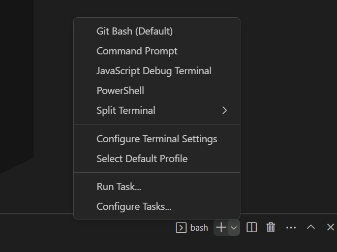
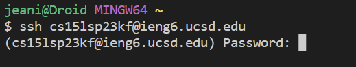
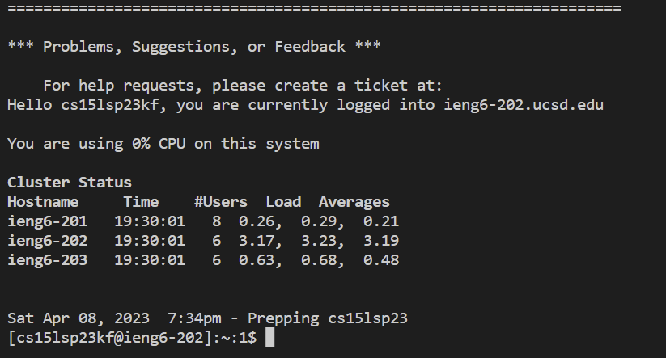
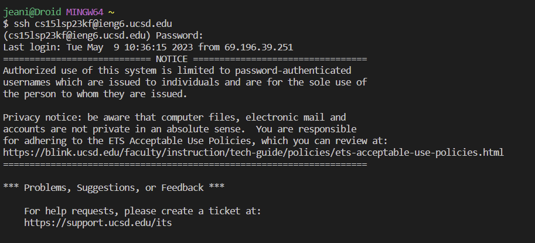
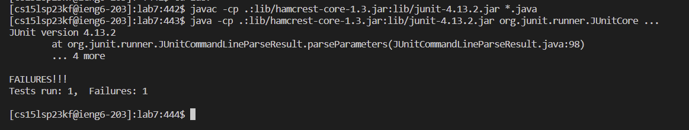

# **Lab Report 4**
In this lab report, I will be reproducing the tasks from Week 7 lab.

## **Part 1** Log into ieng6
I used use `Ctrl` + `Shift` + `p` to open the command palette

After, I type "*Select Default Profile*"

From the options, I selected "*Git Bash*"

Lastly, I clicked the + sign in the terminal window

NOW, in the terminal, I type 

`$ ssh cs15lsp23kf@ieng6.ucsd.edu`

Then I typed in my password.

You will then see this pop up in the terminal

You have now remotely connected!

## **Part 2** Clone your fork of the repository from your Github account
Keys pressed: < up >< up >< up >< up >< up >< up >< enter >
  
I did this to access my previous command I used to clone the fork of my repository from my Github account.

## **Part 3** Run the tests, demonstrating that they fail
Keys pressed: `<up>` `<up>` `<up>``<up>``<enter>`, `<up>``<up>``<up>``<up>``<enter>` 
  
The `javac -cp .:lib/hamcrest-core-1.3.jar:lib/junit-4.13.2.jar *.java` command was 4 up in the search history, so I used up arrows. `java -cp .:lib/hamcrest-core-1.3.jar:lib/junit-4.13.2.jar org.junit.runner.JUnitCore ...` command was 4 up in the history, so I accessed with arrow keys.

## **Part 4** Edit the code file to fix the failing test
To edit from the command line, I typed `vim ListExamples.java` to access the file.

The error is that `index1` is used instead of `index2` in the final loop in `merge`. To fix my errors I entered:

`/index`,`<enter>`, `<shift>`, `<e>`, `<r>`, `<2>`, `:wq`, `<enter>`

## **Part 5** Run the tests, demonstrating that they now succeed
Keys pressed: < up > < up >< up >< enter >, < up >< up >< up >< enter > 
  
The javac -cp .:lib/hamcrest-core-1.3.jar:lib/junit-4.13.2.jar *.java command was 3 up in the search history, so I used up arrows. java -cp .:lib/hamcrest-core-1.3.jar:lib/junit-4.13.2.jar org.junit.runner.JUnitCore ... command was 3 up in the history, so I accessed with arrow keys.
## **Part 6** Commit and push the resulting change to your Github account

< git > < push > < origin > < main >
