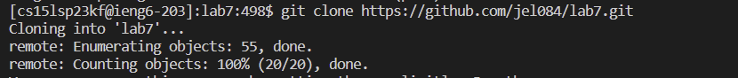
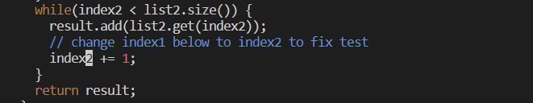
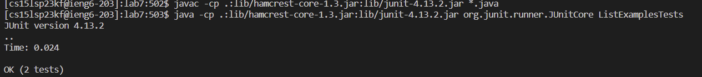
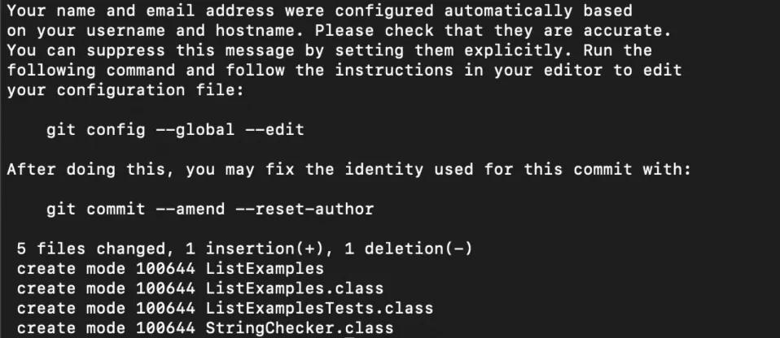

# **Lab Report 4**
In this lab report, I will be reproducing the tasks from Week 7 lab.

## **Part 1** Log into ieng6
I used use `Ctrl` + `Shift` + `p` to open the command palette

After, I type "*Select Default Profile*"

From the options, I selected "*Git Bash*"

Lastly, I clicked the + sign in the terminal window

NOW, in the terminal, I type 

`$ ssh cs15lsp23kf@ieng6.ucsd.edu`

Then I typed in my password.

I saw this in the terminal. 

I was now remotely connected.

## **Part 2** Clone your fork of the repository from your Github account
I typed and pressed: `git clone git@github.com:jel084/lab7.git`,`<enter>`
  

## **Part 3** Run the tests, demonstrating that they fail
Keys pressed: `<up>` `<up>` `<up>` `<up>` `<enter>`, `<up>` `<up>` `<up>` `<up>` `<enter>` 
  
The `javac -cp .:lib/hamcrest-core-1.3.jar:lib/junit-4.13.2.jar *.java` command was 4 up in the search history, so I used up arrows. `java -cp .:lib/hamcrest-core-1.3.jar:lib/junit-4.13.2.jar org.junit.runner.JUnitCore ListExamplesTests` command was 4 up in the history, so I accessed with arrow keys.

## **Part 4** Edit the code file to fix the failing test
To edit from the command line, I typed `vim ListExamples.java` to access the file.

The error is that `index1` is used instead of `index2` in the final loop in `merge`. To fix my errors I entered:

`/index`,`<enter>`, `<shift>`, `<e>`, `<r>`, `<2>`, `:wq`, `<enter>`

`/index` helped me find the `index1` I needed to fix at the bottom of the files. `<shift>`, `<e>` placed my cursor to hover over the number. `<r>`, `<2>` replaced the `1` with a `2`. `:wq`, `<enter>` saved the changed I made in the file.

## **Part 5** Run the tests, demonstrating that they now succeed
Keys pressed: `<up>` `<up>` `<up>` `<enter>`, `<up>` `<up>` `<up>` `<enter>` 
  
The `javac -cp .:lib/hamcrest-core-1.3.jar:lib/junit-4.13.2.jar *.java` command was 3 up in the search history, so I used up arrows. `java -cp .:lib/hamcrest-core-1.3.jar:lib/junit-4.13.2.jar org.junit.runner.JUnitCore ListExamplesTests` command was 3 up in the history, so I accessed with arrow keys.

## **Part 6** Commit and push the resulting change to your Github account
I typed:

`git add .`
`<enter>`
`git commit -m changed`
`<enter>`
`git push`
`<enter>`

