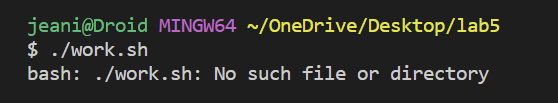
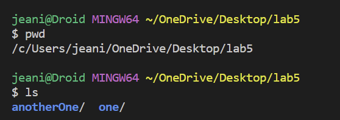
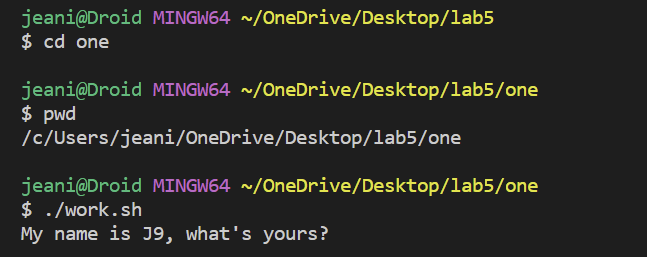

# **Lab Report 5**
In this lab report, I will be creating a debugging scenario and reflecting on this past quarter.

## **Part 1** Debugging Scenario
**Student's Symptom:** 

*What environment are you using (computer, operating system, web browser, terminal/editor, and so on)?*

I am on my laptop in the terminal. I have a `lab5` directory with two folders within (`one` and `anotherOne`). `one` has a bash script called `work.sh` and `anotherOne` has a java file called `test.java`.

*Detail the symptom you're seeing. Be specific; include both what you're seeing and what you expected to see instead. Screenshots are great, copy-pasted terminal output is also great. Avoid saying “it doesn't work”.*

I am trying to run my bash script called `work.sh`. In `work.sh` it should run the java file I have located in `anotherOne`, however, when I type `./work.sh` into the terminal, I get the error `bash: ./work.sh: No such file or directory`. I want to see my java file run and to print out the result `My name is J9, what's yours?`.I provided a picture below of my error.



*Detail the failure-inducing input and context. That might mean any or all of the command you're running, a test case, command-line arguments, working directory, even the last few commands you ran. Do your best to provide as much context as you can.*

I made sure I spelled my bash script command correctly. I made sure that within my bash script, I inputted the correct java file to run. I'm not too sure why it cannot find the file when I typed everything out correctly. Can you help me with this bug?

**TA Response:**

Have you tried using the command `pwd`. This shows the directory you are in. What does this say when you input this into the command line? Which directory are you currently in? The command `ls` is also helpful. Try those commands out and report what you see.

**Student Reponse:**



I tried out the commands `ls` and `pwd` and saw that I was not in the correct directory. Eventhough `work.sh` is in the `lab5` directory, I realized to run `work.sh`, I needed to `cd` into `one` inorder to run the script. I fixed my error by running `cd one` into the terminal, and then i ran `./work.sh`.



**SET UP:**

Here is the directory structure I needed. I created a folder called `lab5` and had two other folders within `anotherOne` and `one`. I had a bash script named `work.sh` in `one` and a java file named `test.java` in `anotherOne`.


Here is the contents within `test.java`

```
public class test {
    public static void main(String[] args) {
        System.out.println("My name is J9, what's yours?");
    }
}
```
Here is the contents within `work.sh`:

```
#!/bin/bash
javac ../anotherOne/test.java
java -cp ../anotherOne test
```

To trigger the bug, I ran

```
./work.sh
```


To fix the bug, you have to enter the lines

```
cd one
```

This is because the student is not able to run the bash script because they are in the wrong directory. Instead of being in the one reletive path, the student was in the lab5 directory. To fix this bug, the student needed to change their directory to `one`, which is where the bash script `work.sh` is located.

## **Part 2** Reflection
From the second half of this quarter, I have learned a lot, but one thing I found that was pretty useful was that one time in lab where we learned about creating a SSH Keys for ieng6. For the forst half of this quarter, we have been needing to input a password, when this whole time, we could have learned how to create a SSH key and skipping the whole process. I think I would rememebr that for the rest of my time here, but that was a pretty cool lesson. Another something we learned was when we had the tutorial about vim and how to edit from the command line, and learning different tricks and shortcuts. Who knew these button clciks would save us so much time; and it was fun just learning abut them and racing against a clock.

